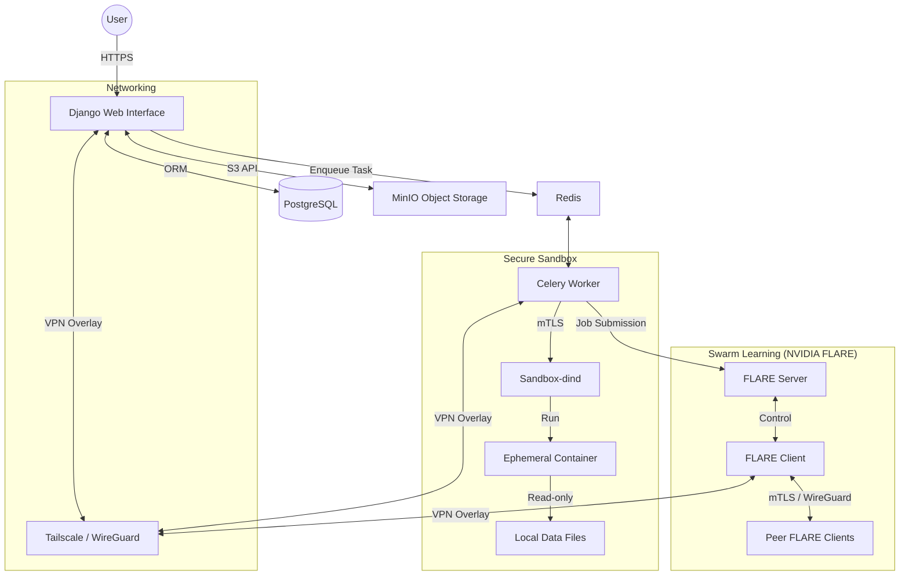
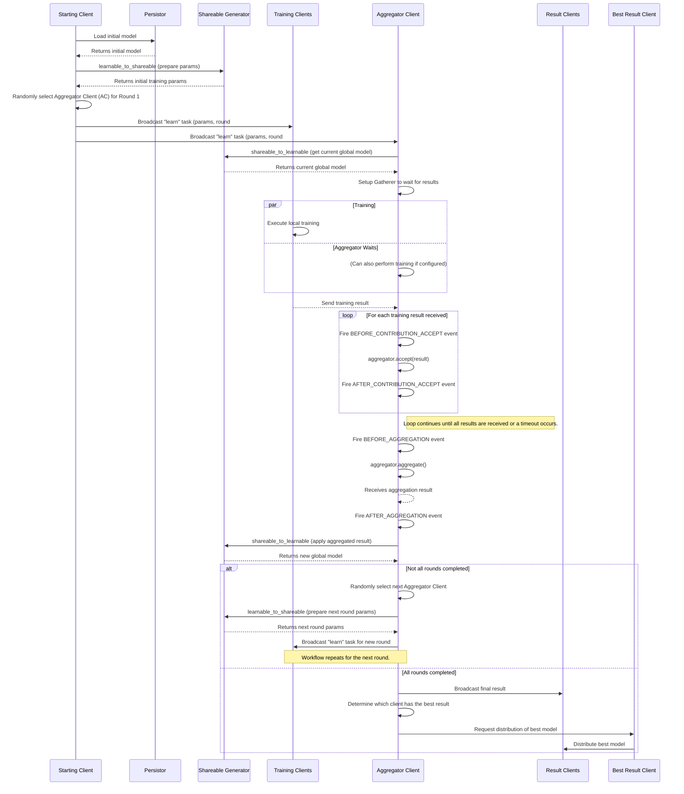

# Background

MedSwarmHub was developed to address the challenges of applying **secure machine learning** to **large scale sensitive medical data** with **simple user interface**. Traditional machine learning requires centralizing data, which is often not feasible or desirable in the medical field due to privacy concerns and data governance regulations.

## System Architecture

MedSwarmHub is composed of several integrated components that work together to provide a secure and scalable decentralized learning environment.

### Key Components

*   **Django Web Interface:** The central hub for project management, data upload, and training orchestration.
*   **Celery Worker:** Handles long-running background tasks such as data synchronization, script execution, and training job monitoring.
*   **MinIO:** Provides S3-compatible object storage for all datasets, models, and scripts.
*   **Sandbox-dind:** An isolated Docker-in-Docker environment used to execute user-provided Python scripts securely.
*   **NVIDIA FLARE:** The core engine for federated and swarm learning. It handles model aggregation and decentralized training workflows.
*   **Tailscale:** Creates a secure, encrypted peer-to-peer overlay network (VPN) between all participants, enabling direct communication even behind restrictive firewalls.

---

## Swarm Learning

### What is Swarm Learning?

Swarm learning is decentralized form of **federated learning** solution, wherein the responsibilities of **aggregation and model training control are distributed to all peers** rather than consolidated in a central server. It uses edge computing and blockchain technology to enable **peer-to-peer collaboration**. Multiple collaborators can **share data insights without sharing the data itself**, protecting data privacy and security while allowing all contributors to **benefit from collective learnings and improved performances**.[^5]

!!! tip "Original Research Paper"

    You can find the original research paper about Swarm Learning here: [Swarm Learning for decentralized and confidential clinical machine learning](https://doi.org/10.1038/s41586-021-03583-3)

### Why is Swarm Learning important?

As more data is collected and processed at the intelligent edge, its true value can only be realized by sharing it and turning it into a collective understanding. However, sharing data like this introduces security risks and in some cases is prohibited by government regulations. Because Swarm Learning shares insights rather than source data, the learnings derived from protected data can be **safely shared across locations and even across organizations**.[^6]

### What are the benefits of Swarm Learning?

Swarm learning offers several key advantages that address major challenges in traditional machine learning approaches. Organizations can combine their proprietary data with learnings from other organizations, **increasing accuracy** and **reducing bias**, while **keeping sensitive data completely on-site**. All cooperating partners can learn from each other without having to share personal patient data, as swarm learning keeps all research data on site, **exchanging only the algorithms and parameters**.
The approach preserves data privacy and sovereignty while reducing bandwidth and storage requirements, eliminating the need to move large datasets to central locations. This is particularly valuable as deep learning models have raised privacy and security concerns due to their reliance on large datasets on central servers. Instead of exposing raw data, users can share learnings at the edge, or at distributed sites, without moving or exposing data.
Swarm learning also enhances the diversity and quality of learning while adapting to dynamic and heterogeneous environments. With no central authority, blockchain is integrated to add control, privacy, and security, creating a trustless system where multiple organizations can collaborate effectively.[^6]

[^5]: Warnat-Herresthal, S., Schultze, H., Shastry, K.L. et al. Swarm Learning for decentralized and confidential clinical machine learning. Nature 594, 265–270 (2021). [https://doi.org/10.1038/s41586-021-03583-3](https://doi.org/10.1038/s41586-021-03583-3)
[^6]: [https://www.hpe.com/us/en/what-is/swarm-learning.html](https://www.hpe.com/us/en/what-is/swarm-learning.html)

### How does Swarm Learning work?

With Swarm Learning, training is done in multiple rounds. In each round, an aggregator client is randomly chosen from all clients, and then all training clients perform the training task on the current global model params. Once completed, all clients send their training results to the designated client for aggregation. The aggregated results are then applied to the current global model, which will become the base for the next round training. This process repeats until the configured number of rounds are completed.[^7]

{ .md-image .md-image--centered }

#### _NVIDIA FLARE_ Swarm Learning architecture

_NVIDIA FLARE_ implementation of swarm learning leverages the newly added **secure peer-to-peer communication** between clients. The `server` is simply responsible for the job lifecycle management (health of client sites and monitoring of job status), while the `clients` are now responsible for training logic and aggregation management (where tasks are assigned via peer-to-peer communication).

Algorithmically, swarm learning is identical to federated averaging with the main differences being that the server will no longer control the aggregation process and will not have access to any sensitive information, such as trained model weights.

- The workflow is started from the `starting_client`. It loads the initial model using the `persistor`, and prepares the initial training params using the `shareable generator`.
- Randomly selects a `client` as the `aggregator` for the next round.
- Broadcast the “learn” task with training params to all `training_clients` and the `aggregation_client`. The task header contains the aggregation client name, the current round number, among other things.
- All `training_clients` do training by invoking the executor configured for the train task.
- Once completed, all `training_clients` send their results to the `aggregation_client`.
- When the “learn” task is received, the `aggregation_client`:
    - Calls the `shareable generator` to compute the current global model based.
    - sets up a Gatherer object to wait for results from `training_clients`. Note that the `aggregation_client` could also be a `training_client`.
- When a training result is received from another client, the Gatherer object of the `aggregation_client` calls the configured aggregator to accept the result.
- After all results are received (or other exit conditions occur such as timeout), the `aggregation_client`:
    - Calls the aggregate method of the aggregator to get the aggregation result.
    - Calls the shareable generator to apply the aggregated result to the current global model.
    - If not all rounds are completed, prepare for next round:
        - Randomly selects the `aggregation_client` for the next round.
        - Calls the `shareable generator` to prepare the training params.
        - Broadcast the “learn” task to other clients for the new round.
    - If all rounds are completed:
          - Broadcast the last result to all `result_clients`
          - Check which client has the best result, and ask that client to distribute the best model to all `result_clients`.[^7]
  

[^7]: [https://nvflare.readthedocs.io/en/2.4/programming_guide/controllers/client_controlled_workflows.html#swarm-learning](https://nvflare.readthedocs.io/en/2.4/programming_guide/controllers/client_controlled_workflows.html#swarm-learning)

## _MINIO_[^2] Object Storage

### What is Minio?

Minio is a high-performance, self-hosted object storage server that is fully compatible with the Amazon S3 API. In the context of MedSwarmHub, it acts as a central repository for all digital assets associated with a decentralized learning project. This includes the training code, datasets, and the resulting models.

### Why is Minio important for MedSwarmHub?

Being self-hosted provides complete control over the physical storage of data, which is a critical requirement when dealing with sensitive information. For a platform like MedSwarmHub, which is designed to handle sensitive medical data, using a self-hosted object storage solution like Minio is highly advantageous. It allows for complete data sovereignty, ensuring that the data is stored in a controlled and secure environment.

### Key Features

*   **S3 Compatibility:** The S3 compatibility is a major plus, as it allows for seamless integration with a wide range of data science tools and libraries.
*   **Encryption:** It supports both encryption at rest (server-side encryption) and encryption in transit (using TLS).
*   **Access Control:** It has a fine-grained access control mechanism with policies that can be defined on a per-user or per-group basis.
*   **Auditing:** All API calls to the Minio server can be logged, providing a detailed audit trail of all data access and modification operations.

## _DJANGO_[^3] Web Interface

### What is Django?

Django is a high-level Python web framework that follows the "batteries-included" philosophy. It provides a comprehensive set of tools and libraries for building web applications, including an Object-Relational Mapper (ORM), an authentication system, and a powerful admin interface.

### Why is Django important for MedSwarmHub?

In MedSwarmHub, Django is the backbone of the web-based user interface, which is the primary way users interact with the platform. The choice of Django for MedSwarmHub is motivated by its robustness, scalability, and strong security features. For a platform that is exposed to the internet and manages sensitive operations, having a framework that is secure by default is crucial.

### Key Features

*   **Rapid Development:** The "batteries-included" nature of Django also accelerates the development process, allowing the team to focus on the core features of the platform rather than reinventing the wheel for common web development tasks.
*   **Security:** Django has a strong focus on security and provides built-in protection against many common web vulnerabilities:
    *   **Cross-Site Scripting (XSS):** Django's template engine automatically escapes variables, which prevents most XSS attacks.
    *   **Cross-Site Request Forgery (CSRF):** Django has built-in CSRF protection that is easy to enable.
    *   **SQL Injection:** Django's ORM uses parameterized queries, which prevents SQL injection vulnerabilities.

## _TAILSCALE_[^4] VPN

### What is Tailscale?

Tailscale is a modern VPN service that makes it easy to create secure networks between computers, servers, and cloud instances. It is built on top of the WireGuard protocol and creates a flat, private network (a "tailnet") where every device can talk to every other device directly.

### Why is Tailscale important for MedSwarmHub?

In a federated learning scenario, especially in swarm learning where clients communicate in a peer-to-peer fashion, establishing secure and reliable connections between participants is a major challenge. Participants are often located in different geographical locations and behind different firewalls. Tailscale solves this problem elegantly by creating a secure overlay network. This is particularly important for the NVIDIA FLARE's swarm learning feature, which relies on peer-to-peer communication between the clients.

### Key Features

*   **Secure Connectivity:** By using Tailscale, MedSwarmHub can ensure that the communication between the federated learning participants is always secure and reliable.
*   **End-to-End Encryption:** All traffic on a Tailscale network is end-to-end encrypted.
*   **WireGuard:** It uses WireGuard, which is a state-of-the-art VPN protocol known for its simplicity, speed, and security.
*   **Simplified Firewall Rules:** Tailscale simplifies firewall management. Once a device is on the tailnet, it can communicate with other devices on the same tailnet without the need for complex firewall rules.

