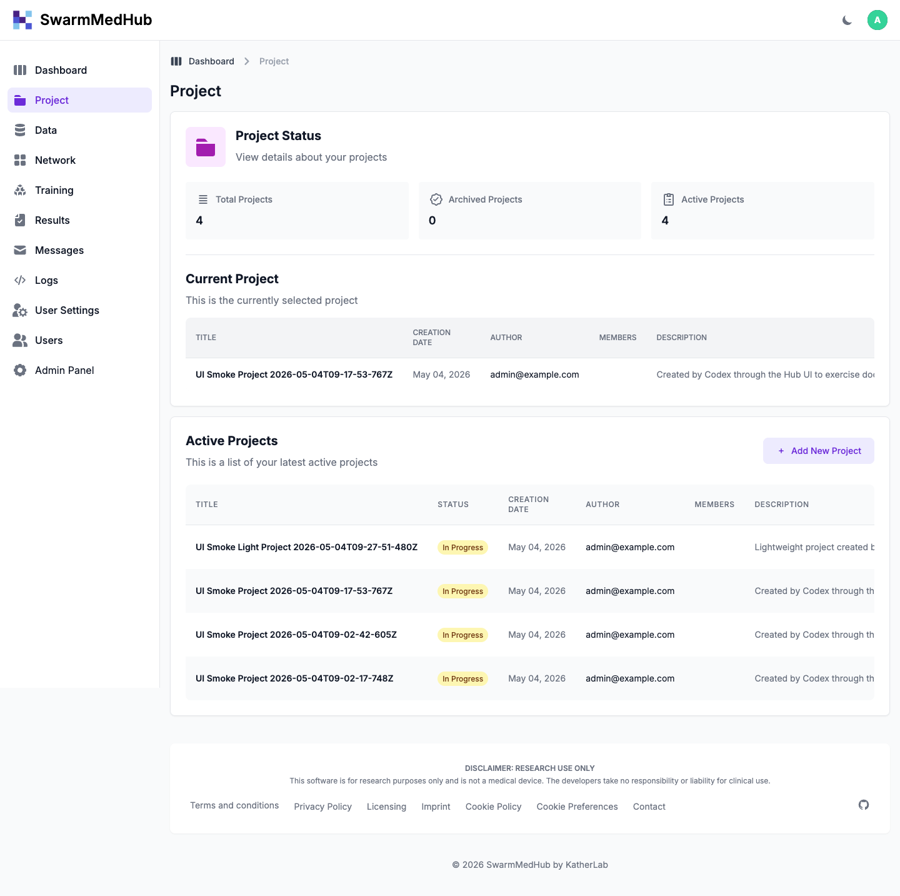
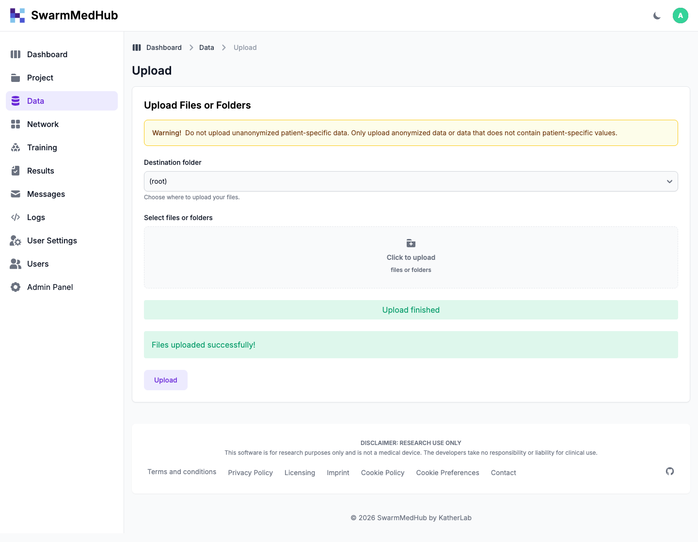
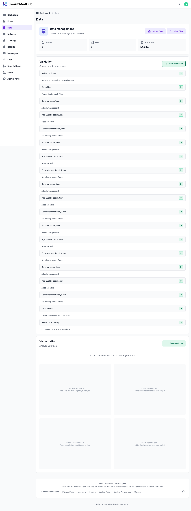
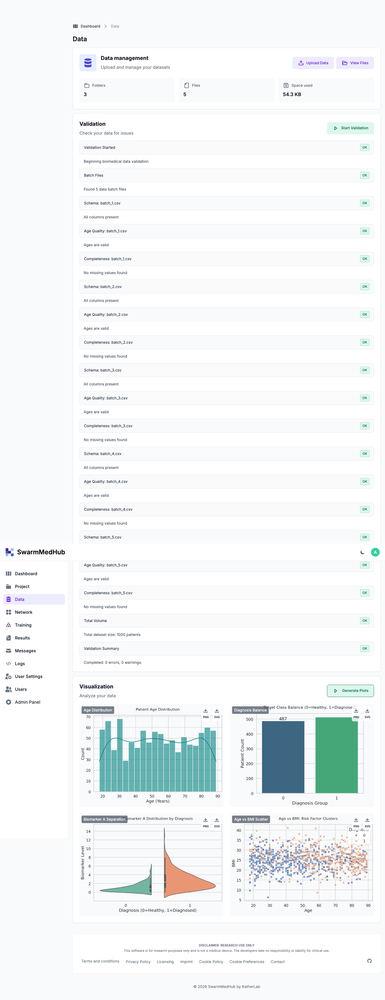
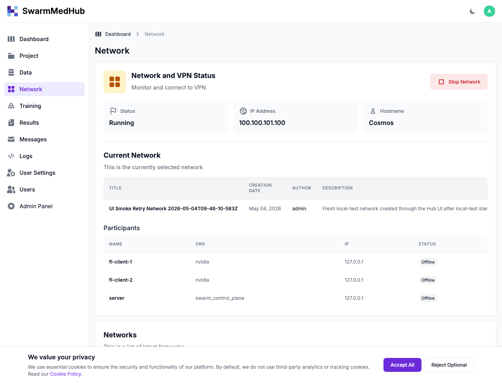
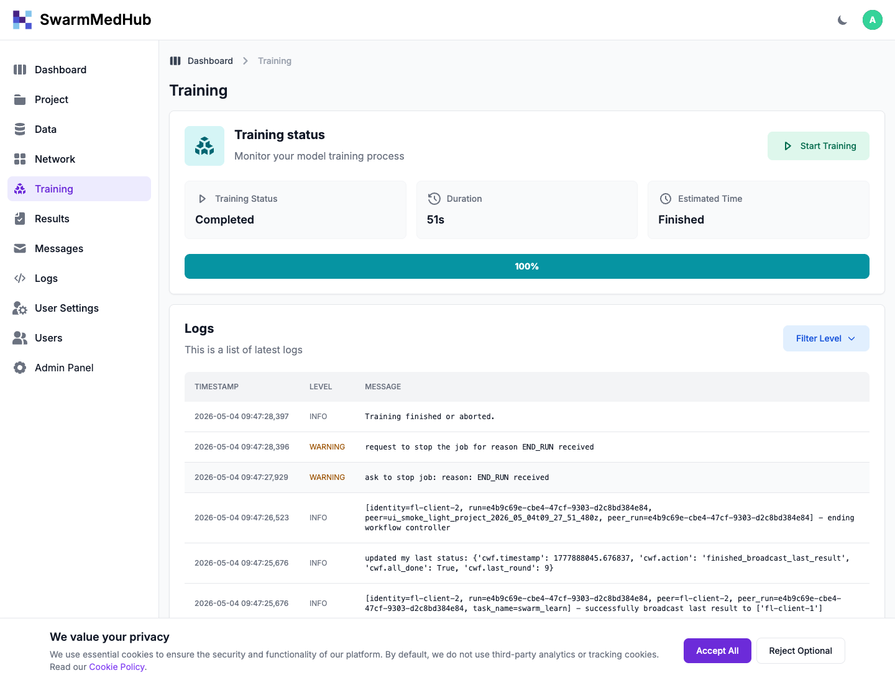

# Hub Server Test Guide

This guide is for a new tester who wants to verify the SwarmMedHub UI on the shared
`hd-cosmos` Linux server. It focuses on the browser workflow from the `/usage`
documentation: create/select a project, upload data, run validation and
visualization, create/select/start a local test network, and start training.

The screenshots below were captured from a successful GUI smoke test on
`hd-cosmos` on May 4, 2026.

## 1. Request Access First

Before testing, ask the maintainer for:

1. Tailscale access to the network that contains `hd-cosmos`.
2. A Hub user account for the test server.
3. Confirmation that testing on `hd-cosmos` is safe at that time.

Do not put shared passwords in commits, docs, issue comments, or chat logs. The
maintainer should send credentials through the agreed secure channel.

After Tailscale access is granted, verify that you can reach the server:

```bash
tailscale status | grep hd-cosmos
ping hd-cosmos
```

If hostname resolution does not work, use the server Tailscale IP:

```text
https://100.100.101.100:5085/
```

The preferred browser URL is:

```text
https://hd-cosmos:5085/
```

The server uses a local/test certificate, so your browser may show a certificate
warning. Continue only if the hostname/IP matches the test server above.

## 2. Server Operator Check

Most testers only need browser access. If you are also responsible for the server,
check the service state over SSH:

```bash
ssh hd-cosmos
cd /home/jeff/Projects/SwarmCloud-1
docker compose ps
```

The core services should be running:

```text
app
nginx
celery_worker
postgres
pgbouncer
redis
minio
sandbox-dind
docker-proxy
```

If the stack is down, start it from the same repo path:

```bash
make start
```

Useful server commands:

```bash
make logs
make restart
make stop
docker compose logs --tail=120 app celery_worker
```

Optional read-only CLI sanity check:

```bash
docker compose exec -T app swarmed project list --user <hub-username> --json
```

On a running image that was built before `PYTHONPATH=/app` was added to the
Dockerfile, use this equivalent command:

```bash
docker compose exec -T -e PYTHONPATH=/app app swarmed project list --user <hub-username> --json
```

## 3. Prepare Local Example Files

For a full UI smoke test, clone the repository on your laptop so you can upload the
example files through the browser:

```bash
git clone https://github.com/pfeifferis/SwarmCloud.git
cd SwarmCloud
git checkout feature/medswarm-cli
```

Use these files during project creation:

```text
examples/scikit-learn/training.py
examples/val.py
examples/viz.py
examples/scikit-learn/res_viz.py
examples/biomed_data/
```

Create a small local `requirements.txt` for the test upload:

```text
pandas==2.3.3
numpy<2.0.0
scikit-learn==1.8.0
python-dotenv==1.0.1
```

## 4. Login

Open the Hub in your browser:

```text
https://hd-cosmos:5085/
```

Log in with the account provided by the maintainer. If this is a brand-new account,
accept the terms page if prompted.

## 5. Create a Project

1. Open **Project** from the sidebar.
2. Click **Add New Project**.
3. Enter a unique title, for example:

   ```text
   UI Manual Test <your-name> <date>
   ```

4. Add a short description.
5. Upload:
   - Training code: `examples/scikit-learn/training.py`
   - Requirements file: the `requirements.txt` created above
   - Data validation script: `examples/val.py`
   - Data visualization script: `examples/viz.py`
   - Results visualization script: `examples/scikit-learn/res_viz.py`
6. Click **Save Project**.
7. On the Project list, click **Set** for your new project.

Expected result: the project appears in the list and can be selected as current.



## 6. Upload Data

1. Open **Data** from the sidebar.
2. Click **Upload Data**.
3. Select the `examples/biomed_data/` folder from your local clone.
4. Click **Upload**.

Expected result: the upload page reports success.



## 7. Run Data Validation

1. Open **Data** from the sidebar.
2. Click **Start Validation**.
3. Wait until the status changes from running/pending to completed.

Expected result: validation completes successfully and shows check results. On the
May 4 smoke test, the Hub reported 19 validation checks.



## 8. Run Data Visualization

1. Stay on **Data**.
2. Click **Generate Plots**.
3. Wait until visualization completes.

Expected result: generated plots appear on the Data page. On the May 4 smoke test,
the Hub reported 4 plots.



## 9. Create a Local Test Network

1. Open **Network** from the sidebar.
2. Click **Add New Network**.
3. Enter a unique title, for example:

   ```text
   Local Test Network <your-name> <date>
   ```

4. Select **Test in local environment**.
5. Click **Create Network**.
6. On the Network list, click **Set as Current** for your network.

Expected result: the current network shows three participants:

```text
server
fl-client-1
fl-client-2
```

If the participant table says no participants were found, stop the test and report
that as a bug.

## 10. Start the Network

1. Stay on **Network**.
2. Click **Start Network**.
3. Wait until the status changes to **Running**.

Expected result: the network reaches **Running**. The server should show one FLARE
server container and two FLARE client containers for the network.



For server operators, this command should show the running test containers:

```bash
docker ps --format "{{.Names}} {{.Status}}" | grep swarm-
```

## 11. Start Training

1. Open **Training** from the sidebar.
2. Click **Start Training**.
3. Watch the status, progress bar, and logs on the Training page.

Expected result: the job starts and progresses. In the May 4 smoke test, the job
completed 10/10 rounds and reached 100%.



## 12. Optional Results Check

After training completes:

1. Open **Results** from the sidebar.
2. Click **Sync Results**.
3. Confirm that result artifacts are listed.
4. Optionally click **Run Visualization** if a results visualization script was
   uploaded with the project.

## 13. What Was Verified on May 4, 2026

The latest GUI smoke test on `hd-cosmos` verified:

| Area | Result |
| --- | --- |
| Project creation | Passed |
| Current project selection | Passed |
| Data upload | Passed |
| Data validation | Passed |
| Data visualization | Passed |
| Local test network creation | Passed |
| Current network selection | Passed |
| Network startup | Passed |
| Training start from GUI | Passed |
| Training completion | Passed, 10/10 rounds |

The successfully tested project was:

```text
UI Smoke Light Project 2026-05-04T09-27-51-480Z
```

The successfully tested network was:

```text
UI Smoke Retry Network 2026-05-04T09-46-10-583Z
```

## 14. Troubleshooting

### Cannot open the Hub

Check Tailscale first:

```bash
tailscale status | grep hd-cosmos
```

Try both URLs:

```text
https://hd-cosmos:5085/
https://100.100.101.100:5085/
```

If both fail, ask a server operator to check:

```bash
ssh hd-cosmos
cd /home/jeff/Projects/SwarmCloud-1
docker compose ps
docker compose logs --tail=120 nginx app
```

### Validation or visualization stays pending

Ask a server operator to inspect the app and Celery logs:

```bash
cd /home/jeff/Projects/SwarmCloud-1
docker compose logs --tail=160 app celery_worker
```

Validation and visualization use the sandbox image. If the sandbox image needs to
be rebuilt and package downloads fail inside Docker-in-Docker, report that as a
sandbox build networking issue.

### Network startup fails

Check the Network page logs and then inspect Celery:

```bash
docker compose logs --tail=200 celery_worker
```

For local test networks, the Hub should not require host ports `8002` and `8003`.
Those ports may already be used by unrelated FLARE services on `hd-cosmos`.

Do not stop unrelated containers unless you own them. In particular, the server may
have other long-running FLARE experiments.

### Training does not start

Confirm:

1. The current project has `training.py` and `requirements.txt`.
2. The current network is **Running**.
3. The Training page has a **Start Training** button for the current network.

Then inspect:

```bash
docker compose logs --tail=200 app celery_worker
docker ps --format "{{.Names}} {{.Status}}" | grep swarm-
```

### Clean up after a smoke test

From the UI, delete test projects and networks that you no longer need. If a
network is running, stop it before deleting when possible.

Server operators can confirm that no test runtime containers remain:

```bash
docker ps --format "{{.Names}} {{.Status}}" | grep swarm-
```
